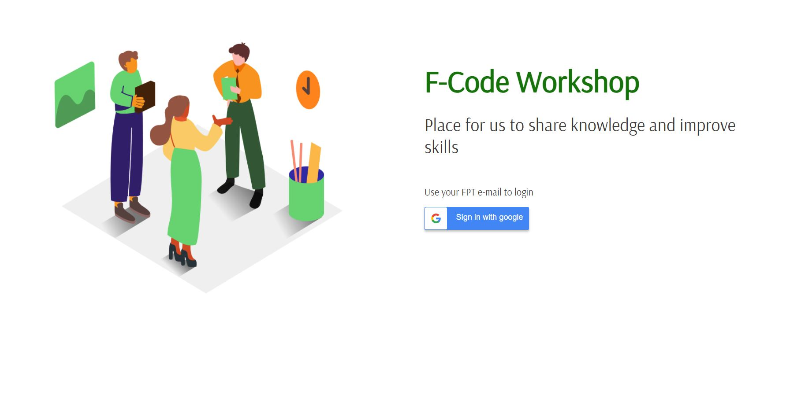
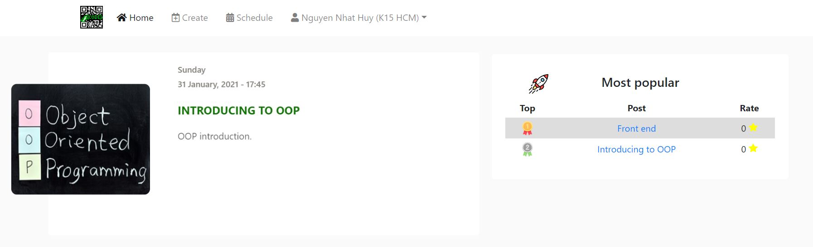
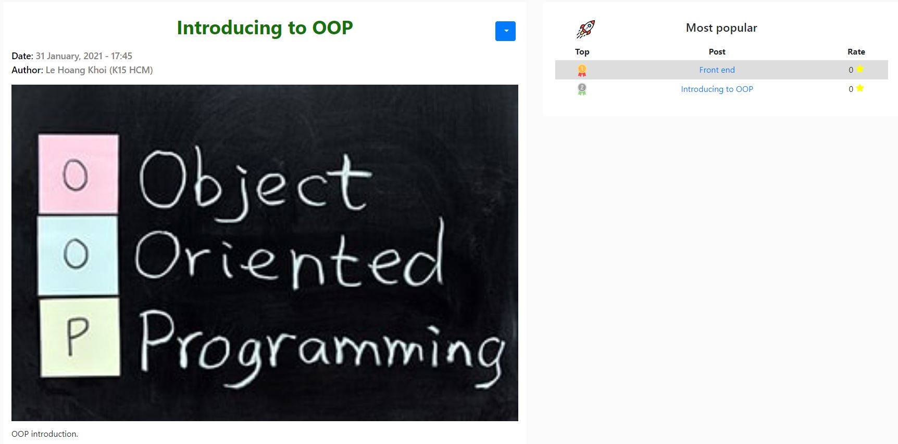
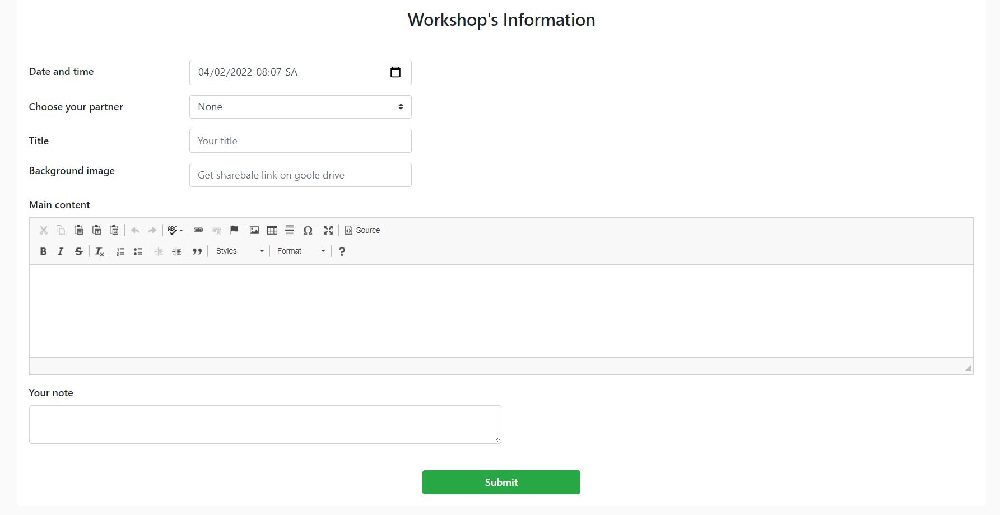
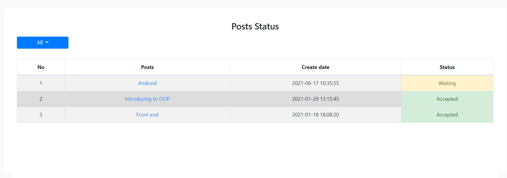
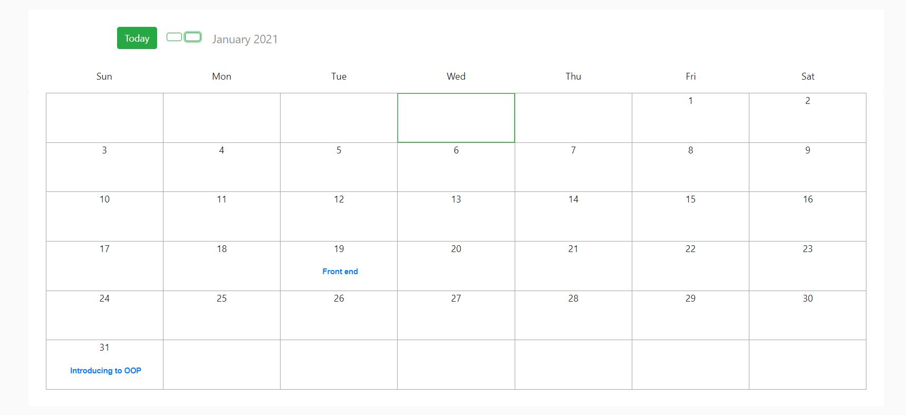

# Workshop F-Code

## Overview

A platform that helps everyone in the club create an experience-sharing workshop. [Demo](https://workshop-fcode.herokuapp.com)

## Features

- Create a topic, wait for an admin to approve, reject the post.
- Rate and comment on this topic.
- Most popular topics.
- An overview of what workshops will be available in month.

## Tech

- Backend: Express, MongoDB + Mongoose
- Frontend: HTML, CSS, Vanilla Javascript

## Images

Login page

All post page

Post detail page

Create post page

Posts status page

Schedule page

## Member

- Backend: Nguyễn Nhật Huy, [Github](https://github.com/oHTGo)
- Fronend:
  - Lê Hoàng Khôi, [Github](https://github.com/lehoangkhoi01)
  - Đặng Phương Anh, [Github](https://github.com/panhpanh)
